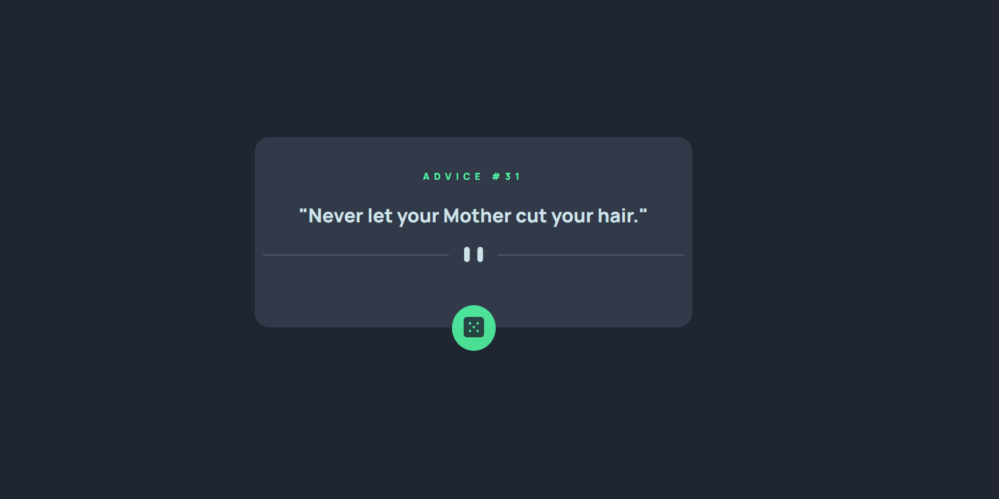

# Frontend Mentor - Advice generator app solution

This is a solution to the [Advice generator app challenge on Frontend Mentor](https://www.frontendmentor.io/challenges/advice-generator-app-QdUG-13db).
## Table of contents

- [Overview](#overview)
  - [The challenge](#the-challenge)
  - [Screenshot](#screenshot)
  - [Links](#links)
- [My process](#my-process)
  - [Built with](#built-with)
  - [What I learned](#what-i-learned)
  - [Continued development](#continued-development)
  - [Useful resources](#useful-resources)
- [Author](#author)

## Overview

### The challenge

Users should be able to:

- View the optimal layout for the app depending on their device's screen size
- See hover states for all interactive elements on the page
- Generate a new piece of advice by clicking the dice icon

### Screenshot

### Links

- Solution URL: [https://github.com/wendycheang/advice-generator-app](https://github.com/wendycheang/advice-generator-app)
- Live Site URL: [https://profound-dusk-befad1.netlify.app/](https://profound-dusk-befad1.netlify.app/)

## My process

### Built with

- Semantic HTML5 markup
- CSS custom properties
- Mobile-first workflow
- [React](https://reactjs.org/) - JS library

### Continued development

I would like to continue doing more React practice and work

### Useful resources

- [React useCallback Doc](https://react.dev/reference/react/useCallback) - Helped me out with useCallback 
- [Mozilla Clamp Docs](https://developer.mozilla.org/en-US/docs/Web/CSS/clamp) - 
  Reminded me of using clamp

## Author

- Frontend Mentor - [@wendycheang](https://www.frontendmentor.io/profile/wendycheang)

